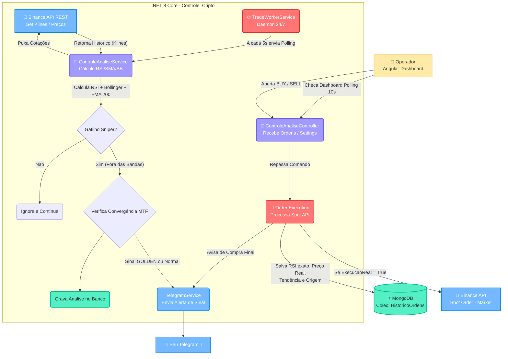
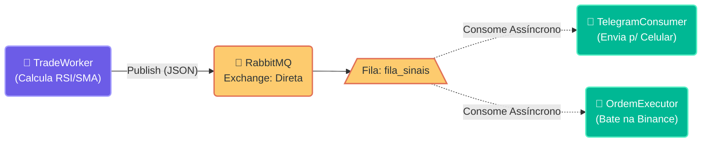

# 🚀 O Caçador de Tendência: Sniper RSI & SMA (Trading Worker)

> **Plataforma Avançada de Algo-Trading para Negociação de Criptoativos na Binance (Spot Market).**

---

## 🎯 A Filosofia da Ferramenta

O trading humano sofre com fadiga, FOMO e emoção. O **Caçador de Tendência** foi desenvolvido como uma arma (Sniper) assíncrona que varre o mercado 24 horas por dia em busca de um alinhamento matemático raro, cruzando RSI (Índice de Força Relativa) Extremo com Rompimento Severo de Bandas de Bollinger.

**Principais Filtros de Operação:**
1. **RSI < 20 (Sobrevenda) ou > 80 (Sobrecompra):** Encontra momento de exaustão extrema de mercado.
2. **Bollinger Band Breakout (Desvio de 2.5):** Ignora ruídos normais. O ativo precisa ter ultrapassado violentamente a média histórica.
3. **Convergência Multi-Timeframe (MTF):** *(The Golden Signal)*. Confirma uma exaustão em M1 ou M5 checando se em M15 ou H1 o ativo também já está esgotado.

---

## 🏗 Arquitetura & Fluxograma Lógico

O diagrama abaixo ilustra detalhadamente como o Backend interage com os inputs matemáticos, MongoDB, Frontend e o envio de requisições para a Exchange e para o Telegram.

---

## 🐇 Evolução para Microserviços: Event-Driven com RabbitMQ

O projeto evoluiu de um modelo **Monolítico Síncrono** para uma arquitetura Reativa Orientada a Eventos usando **RabbitMQ**.

No modelo antigo, se a API do Telegram ficasse offline, a thread principal do `TradeWorkerService` congelava, perdendo janelas críticas de compra na Binance.

Com o RabbitMQ, o fluxo segue os preceitos de **SOLID** (Single Responsibility) e **Clean Architecture**:
1. **O Produtor:** O `TradeWorkerService` apenas calcula matemática e cospe o evento JSON na fila `fila_sinais`.
2. **O Consumidor:** O `TelegramNotificationConsumer` observa a fila de forma assíncrona. Quando a mensagem chega, ele consome, formata e envia.

*Se o Telegram cair, a mensagem sofre Requeue (NACK) e o Bot de Trade continua varrendo o mercado nativamente sem atrasos (na casa dos milissegundos).*

---

## 🛠 Entendendo o Processo Detalhadamente

1. **Ingestão de Dados (`TradeWorkerService`):** Um serviço autônomo executa um *loop* lendo as principais moedas listadas (BTC, ETH, SOL...). Ele usa a biblioteca `Binance.Net` para puxar os *Klines* (velas) da API.
2. **O Cálculo Matemático (`Skender.Stock.Indicators`):** Em posse de 300 velas fechadas, aplicamos os cálculos de RSI (relativo a 14 períodos) e Bollinger Bands. Se a `Execução Dinâmica` for ativada e o RSI chegar em níveis como `<= 20` enquanto o preço estiver abaixo da `LowerBand`, acendemos o alerta amarelo.
3. **Convergência de Confluência (MTF):** Um sinal não basta. O código analisa o mesmo par em um *Timeframe* muito maior. Se este tempo maior também se encontra sobrevendido/sobrecomprado, ele classifica aquele momento exato como "CONVERGÊNCIA DETECTADA". A probabilidade de reversão rápida nos próximos 5 minutos aumenta em 90%.
4. **Log Estratégico Telemetrizado:** Todo cruzamento matemático e todas as ordens (vindas de execução manual via UI ou Automáticas do Robô) vão parar no **MongoDB (`HistoricoOrdens`)**. Quando a Ordem engatilha na plataforma, não salvamos apenas que "Compramos BTC" – nós salvamos "Compramos BTC a $65k, o RSI daquele milissegundo era de 21.05 e a Tendência era Berish". Feito para análise de *Data Science* posterior.
5. **Comando de Fogo (Execução Real):** Quando a ordem é de execução verdadeira, o motor envia uma boleta *Market* (A mercado) com criptografia HmacSha256 (via SDK) confirmando o token e o secret para a Binance, retornando instantaneamente o `AverageFillPrice` (evitando erro de *slippage* visual). Todo o processo – de engatilhar o código no Angular a vibrar o aviso do Telegram de compra feita – acontece em < 1 segundo.

## ⚙️ Variáveis de Ambiente Necessárias

Para rodar este monstro localmente, configure no seu arquivo `appsettings.json`:
- `BinanceSettings:ApiKey` e `ApiSecret`: Suas chaves de Spot Trade.
- `Telegram:Token` e `ChatId`: Os dados do seu Bot do Telegram Tracker.
- `MongoDbSettings`: A string de conexão do seu DB local ou nuvem.
